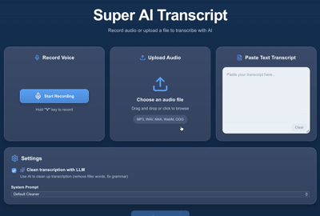
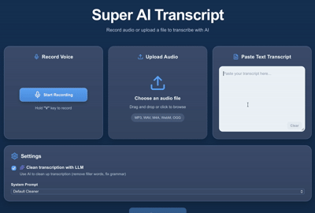

# Voice Notes AI

A local-first AI application for recording, transcribing, and cleaning voice notes using **Faster-Whisper** and **Ollama**.

Voice Notes AI lets you record audio directly in the browser, upload an existing audio file, or paste text. Audio is transcribed locally with Faster-Whisper, and the resulting transcript can optionally be cleaned or rewritten by a locally running language model through Ollama.

The application is built with **React, TypeScript, FastAPI, Faster-Whisper, Ollama, and Docker** and does not require a cloud AI API for its standard local workflow.

> **Local-first:** audio transcription and LLM-based text processing can run entirely on your machine. Actual privacy depends on how and where the application is deployed.

---
## Demo

### Voice Transcription

Record or upload audio, transcribe it locally with Faster-Whisper, and clean the transcript with Ollama.



### Text Cleanup

Paste an existing transcript and use a local LLM to remove filler words and improve readability.



**Input**

- Record from your microphone
- Upload an audio file
- Paste an existing transcript

**Processing**

```text
Audio
  │
  ▼
Faster-Whisper
  │
  ▼
Original Transcript
  │
  ▼
Ollama
  │
  ▼
Cleaned Transcript
```

For pasted text:

```text
Text
  │
  ▼
Ollama
  │
  ▼
Cleaned Text
```

---

## Features

- **Browser voice recording** using the MediaRecorder API
- **Hold `V` to record** keyboard shortcut
- **Drag-and-drop audio upload**
- **Audio preview** before processing
- **Local speech-to-text** with Faster-Whisper
- **Local LLM processing** through Ollama
- **Three cleanup modes:** default, formal, and short
- **Optional AI cleanup** — transcription can be used without an LLM
- **Original and cleaned transcript comparison**
- **Copy cleaned transcript** directly from the interface
- **Audio and request validation**
- **Structured API error handling**
- **Docker Compose** environment for the complete application
- **Automated backend and frontend tests**
- **GitHub Actions CI**

### Supported Audio Formats

```text
.mp3  .wav  .m4a  .webm  .ogg  .mp4
```

The default maximum upload size is **25 MB**.

---

## Cleanup Modes

Voice Notes AI provides three LLM-powered cleanup modes.

| Mode | Purpose |
| --- | --- |
| `default` | Improves grammar, punctuation, capitalization, filler words, and false starts while preserving meaning |
| `formal` | Rewrites the transcript in a more professional style |
| `short` | Produces a more concise version while preserving important information |

AI cleanup can also be disabled completely.

---

## Architecture

```text
┌──────────────────────────────┐
│           Browser            │
│                              │
│   React + TypeScript + Vite  │
└──────────────┬───────────────┘
               │
               │ HTTP
               ▼
┌──────────────────────────────┐
│        FastAPI Backend       │
│                              │
│  /audio/process              │
│  /text/process               │
│  /health                     │
└───────────┬──────────┬───────┘
            │          │
            │          │
            ▼          ▼
   ┌──────────────┐  ┌──────────────┐
   │   Faster-    │  │    Ollama    │
   │   Whisper    │  │              │
   │              │  │  llama3.2    │
   │ Speech → Text│  │ Text cleanup │
   └──────────────┘  └──────────────┘
```

The frontend handles recording, uploads, configuration, and transcript presentation. FastAPI provides the processing API and coordinates local speech recognition and LLM inference.

---

## Tech Stack

| Area | Technologies |
| --- | --- |
| Frontend | React 19, TypeScript, Vite |
| Backend | Python, FastAPI, Pydantic, Uvicorn |
| Speech Recognition | Faster-Whisper |
| LLM | Ollama, Llama 3.2 |
| Frontend Testing | Vitest, Testing Library |
| Backend Testing | pytest |
| Infrastructure | Docker, Docker Compose, Nginx |
| CI | GitHub Actions |

---

## Quick Start with Docker

### Requirements

You need:

- Docker
- Docker Compose

Clone the repository:

```bash
git clone git@github.com:salehmmrezaei/voice-notes-ai.git
cd voice-notes-ai
```

Build and start the application:

```bash
docker compose up --build -d
```

The stack starts:

```text
Frontend     → React + Nginx
Backend      → FastAPI + Faster-Whisper
Ollama       → Local LLM inference
```

### Install the Ollama Model

Check the models installed in the Ollama container:

```bash
docker exec -it transcript-ollama ollama list
```

If `llama3.2` is not installed:

```bash
docker exec -it transcript-ollama ollama pull llama3.2
```

### Open the Application

Frontend:

```text
http://localhost:5173
```

FastAPI:

```text
http://localhost:8000
```

Interactive API documentation:

```text
http://localhost:8000/docs
```

Health endpoint:

```text
http://localhost:8000/health
```

Check the running containers:

```bash
docker compose ps
```

Stop the application:

```bash
docker compose down
```

Ollama models are stored in a persistent Docker volume and remain available after a normal shutdown.

To remove the volume as well:

```bash
docker compose down -v
```

---

## Local Development

### Backend

Requirements:

- Python 3.11+
- Ollama

Create and activate a virtual environment:

```bash
cd backend

python -m venv .venv
source .venv/bin/activate
```

On Windows:

```bash
.venv\Scripts\activate
```

Install the dependencies:

```bash
pip install -r requirements.txt
```

Start the backend:

```bash
uvicorn app.main:app --reload
```

The API will be available at:

```text
http://127.0.0.1:8000
```

### Ollama

Install Ollama separately and pull the default model:

```bash
ollama pull llama3.2
```

Verify that it is available:

```bash
ollama list
```

The backend expects the local Ollama API at:

```text
http://127.0.0.1:11434/api/chat
```

### Frontend

In another terminal:

```bash
cd frontend
npm install
npm run dev
```

The development frontend will normally be available at:

```text
http://localhost:5173
```

---

## Configuration

The backend supports the following environment variables:

```env
OLLAMA_URL=http://127.0.0.1:11434/api/chat
OLLAMA_MODEL=llama3.2

WHISPER_MODEL=base
WHISPER_DEVICE=cpu
WHISPER_COMPUTE_TYPE=int8

MAX_AUDIO_SIZE_BYTES=26214400
```

### Whisper Configuration

The default transcription configuration is:

```text
Model:        base
Device:       CPU
Compute type: int8
```

Other Faster-Whisper models can be configured, including:

```text
tiny
small
medium
large-v3
```

Larger models may improve transcription quality but require more memory and processing time.

### Frontend API URL

For local frontend development, create:

```text
frontend/.env
```

with:

```env
VITE_API_BASE_URL=http://127.0.0.1:8000
```

---

## API

FastAPI automatically exposes interactive documentation at:

```text
http://localhost:8000/docs
```

### Health Check

```http
GET /health
```

Example response:

```json
{
  "status": "ok"
}
```

### Process Text

```http
POST /text/process
```

Example request:

```json
{
  "text": "um hello this is my transcript",
  "clean_with_llm": true,
  "system_prompt": "default"
}
```

Example response:

```json
{
  "source": "text",
  "original_text": "um hello this is my transcript",
  "cleaned_text": "Hello, this is my transcript.",
  "clean_with_llm": true,
  "system_prompt": "default",
  "audio": null
}
```

Available prompt modes:

```text
default
formal
short
```

When `clean_with_llm` is `false`, the original text is returned without contacting Ollama.

### Process Audio

```http
POST /audio/process
```

Content type:

```text
multipart/form-data
```

Fields:

```text
file
clean_with_llm
system_prompt
```

Example response:

```json
{
  "source": "audio",
  "original_text": "Um this is a transcript.",
  "cleaned_text": "This is a transcript.",
  "clean_with_llm": true,
  "system_prompt": "default",
  "audio": {
    "filename": "recording.wav",
    "content_type": "audio/wav"
  }
}
```

---

## Validation and Error Handling

The backend validates input before processing, including:

- unsupported audio formats
- empty files
- oversized uploads
- corrupt or unreadable audio
- audio containing no detectable speech
- empty text
- invalid cleanup modes

Temporary audio files are removed after processing.

The API also converts common local-LLM failures into useful HTTP responses:

```text
503  Ollama unavailable
503  Ollama model not installed
504  Ollama request timed out
502  Invalid Ollama response
```

Audio transcription and validation failures return appropriate `400`, `413`, or `422` responses.

---

## Testing

The project contains automated backend and frontend tests.

External AI components are mocked during the normal automated test suite, so tests do not require an Ollama server or downloaded Whisper model.

### Backend

Run:

```bash
cd backend
pytest -v
```

The tests cover areas including:

- health checks
- text processing
- audio processing
- input validation
- mocked Whisper transcription
- mocked Ollama processing
- unavailable or missing Ollama models
- timeouts and invalid responses
- unsupported and invalid audio

### Frontend

Run:

```bash
cd frontend
npm run test:run
```

Additional quality checks:

```bash
npm run lint
npm run build
```

---

## Continuous Integration

GitHub Actions runs automatically on pushes to `main` and pull requests.

The backend CI job:

```text
Install Python dependencies
        ↓
Run pytest
```

The frontend CI job:

```text
npm ci
   ↓
Lint
   ↓
Production Build
   ↓
Vitest
```

This validates both the backend API and frontend application before changes are merged.

---

## Privacy

Voice Notes AI is designed around local AI processing.

In the standard local setup:

- audio is transcribed locally with Faster-Whisper
- LLM inference runs locally through Ollama
- transcripts do not need to be sent to a third-party AI API
- temporary audio files used by the backend are deleted after processing

Actual privacy and security depend on the environment in which the application is deployed.

---

## Project Structure

```text
voice-notes-ai/
├── .github/
│   └── workflows/
│       └── ci.yml
├── backend/
│   ├── app/
│   │   ├── routers/
│   │   ├── schemas/
│   │   ├── services/
│   │   ├── utils/
│   │   ├── config.py
│   │   ├── main.py
│   │   └── prompts.py
│   ├── tests/
│   ├── Dockerfile
│   └── requirements.txt
├── frontend/
│   ├── src/
│   │   ├── components/
│   │   ├── services/
│   │   ├── types/
│   │   └── App.tsx
│   ├── Dockerfile
│   └── package.json
├── docker-compose.yml
├── .env.example
└── README.md
```

---

## Project Status

Voice Notes AI is a complete working application with:

- [x] Browser microphone recording
- [x] Hold-to-record keyboard shortcut
- [x] Audio file upload
- [x] Audio preview
- [x] Text input
- [x] Faster-Whisper transcription
- [x] Local Ollama text cleanup
- [x] Multiple cleanup modes
- [x] Optional LLM processing
- [x] Input validation and API error handling
- [x] Backend automated tests
- [x] Frontend automated tests
- [x] Dockerized frontend
- [x] Dockerized backend
- [x] Dockerized Ollama
- [x] Persistent Ollama model storage
- [x] Docker health checks
- [x] GitHub Actions CI

---

## Possible Future Improvements

The core application is complete. Potential extensions include:

- speaker diarization
- transcription timestamps
- GPU-accelerated transcription
- transcript history
- additional frontend component tests
- TXT or Markdown export
- automatic Ollama model initialization

---

## License

No license has been specified yet.
